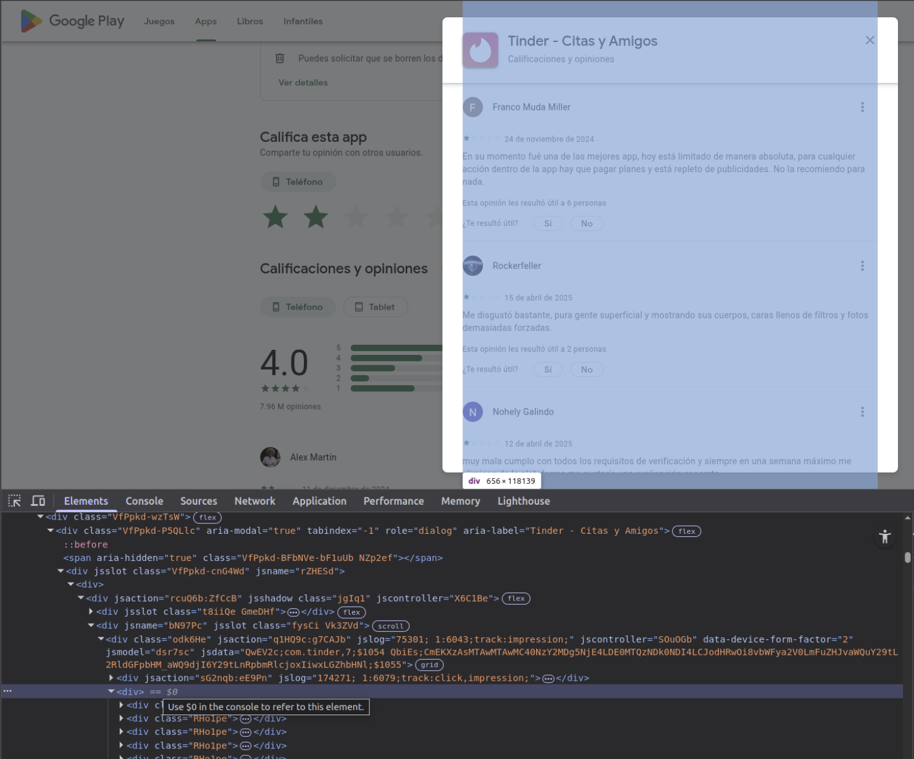

# Review Extractor

A simple Node.js script to extract user reviews from structured HTML files, such as Google Play reviews or similar layouts.

This script parses each review block and extracts:

* **User name**
* **Review date**
* **Star rating**
* **Comment text**

It does so **without relying on class names or attributes**, making it more robust across similar structured HTML pages.

---

## 🚀 Usage

### 1. Install dependencies

```bash
npm install cheerio
```

### 2. Prepare your HTML

To extract the reviews from a Google Play app:

1. Open the app's page on Google Play.

2. Click to open the reviews modal.

3. Open **Developer Tools** in your browser (Right-click > Inspect or press `Ctrl+Shift+I`).

4. Locate the `<div>` that contains the reviews. Below is a screenshot showing where to look:

   

5. Right-click on the **parent `<div>` of the review**.

6. Choose **"Copy element"**.

7. Paste the copied HTML into a file named `reviews.html` in the same folder as the script.

Make sure the HTML includes one parent `<div>` with multiple child `<div class="RHo1pe">` elements. Each review must have the same structure.

### 3. Run the script

```bash
node index.js output_filename
```

* `output_filename` is required and **should not include `.json`**.
* The script will generate `output_filename.json` with the extracted data.

**Example:**

```bash
node index.js reviews
```

Creates: `reviews.json`

---

## 📆 Output format

Each review will be saved in JSON format like this:

```json
[
  {
    "user": "RAUL FONSECA",
    "date": "28 de marzo de 2025",
    "stars": 4,
    "comment": "creo que la app es una gran herramienta..."
  },
  ...
]
```

---

## 🛠 Technologies

* [Node.js](https://nodejs.org/)
* [Cheerio](https://cheerio.js.org/)

---

## 📄 License

MIT License. Feel free to use and modify.
